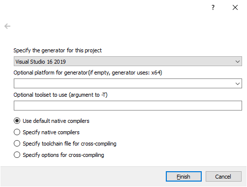

## Use CMake on Windows to compile GEARS

We can use [CMake][] to generate a C++ project file, an XML file that has the .[vcxproj][] extension, and a [Visual Studio][] solution file (.[sln][]). They will be used by [Visual Studio][] to compile [GEARS][].

Please make sure that you select "Add CMake to the system PATH" during the installation of [CMake][]:

After installation, launch [CMake][], set "Where is the source code" to where [gears.cc](../../gears.cc) is located, and "Where to build the binaries" to anywhere you like, but we prefer a new directory called `build` within the directory where [gears.cc](../../gears.cc) is located:

Press the `Configure` bottom, you will be prompt to "Specify the generator for this project". `CMake` should be able to select [Visual Studio][] automatically. You just need to press the `Finish` bottom to confirm it:

Now, you should be able to see the following window:

If your [Geant4][] is installed correctly, `CMake` should be able to find it and set `Geant4_DIR` correctly. If not, you can still manually modify it in this window.

Press `Generate` and then `Open Project`. [Visual Studio][] will be open automatically. If this is the first time you call [Visual Studio][] from within `CMake`, you may see the following window:

Press OK to confirm that you'd like to use [Visual Studio][] to open the .[sln][] file created by `CMake`.

Inside [Visual Studio][], press the bottom shown in the following screenshot:

Upon a successful compilation, [Visual Studio][] will automatically run `gears.exe` for you:

You should also be able to run `gears.exe` anywhere you want since its containing directory has been added to the Windows `%PATH%` automatically by `CMake`.

[CMake]: https://cmake.org
[vcxproj]: https://learn.microsoft.com/en-us/cpp/build/reference/project-files
[Visual Studio]: https://visualstudio.microsoft.com
[GEARS]: https://github.com/jintonic/gears
[sln]: https://learn.microsoft.com/en-us/visualstudio/extensibility/internals/solution-dot-sln-file
[Geant4]: http://geant4.cern.ch
