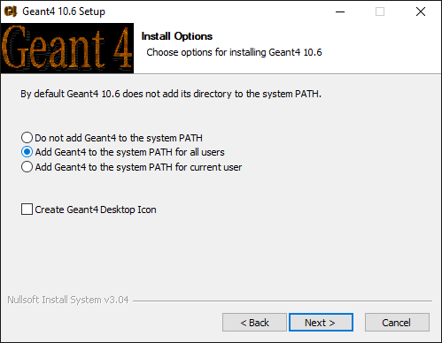

[](#docker-images)
[](https://cloud.sylabs.io/library/jintonic/geant4/gears)
[](#install-pre-compiled-geant4-on-windows)
[](#install-pre-compiled-geant4-on-macos)
[](#install-pre-compiled-geant4-on-centos)

# Install Geant4
[](https://www.youtube.com/playlist?list=PLw3G-vTgPrdB9Nt2ekl2oL1yoqEC294Uf)

[GEARS][] relies on [Geant4][]. The latest [GEARS][] requires [Geant4][] version 11. If you only have version 10 available, you can use a branch of [GEARS][], called [g4.10](https://github.com/jintonic/gears/tree/g4.10). Due to [some inconvenience in version 9](http://hypernews.slac.stanford.edu/HyperNews/geant4/get/hadronprocess/1242.html), [GEARS][] does not support [Geant4][] below version 10. Optionally, the following two packages can be installed before [Geant4 installation]():

* (Optional) [Xerces-C++][], to use or export detector geometries in [GDML][] format.
* (Optional) [HDF5][], to save simulation results in [HDF5][] format.

Before you get started, please understand that the [Geant4 Installation Guide](https://geant4-userdoc.web.cern.ch/geant4-userdoc/UsersGuides/InstallationGuide/html/) is your ultimate reference should you have any issue regarding [Geant4][] installation, and the Geant4 [User Forum](https://geant4-forum.web.cern.ch/) is the place to seek for help.

You also need to be aware of [the possibility of installing pre-comipled Geant4 libraries](https://www.youtube.com/watch?v=fu3NLgb0fwI) in some OS, which would save you hours of time and potential headaches.

Yet another option is to use [Docker](Docker) or [Apptainer](../Apptainer) images that already have [Geant4][] and [GEARS][] included, for example, <https://hub.docker.com/r/physino/gears>.

[Xerces-C++]: https://xerces.apache.org/xerces-c
[HDF5]: https://www.hdfgroup.org/solutions/hdf5

## Which OS should you use for Geant4 simulation?
[](https://youtu.be/_g3nvEbhOx8)

**Short Answer:** The one you are using right now. Technically, Geant4 works fine in Windows, Linux and MacOS.

**Long Answer:** It depends, on

- whom you can ask for help from. If everybody around you uses Linux or Mac and trashes Windows, join them. You don't have to trash anything, but it is a great opportunity for you to learn something different from them. The competition among these three OS keeps pushing them all to get better. Open your mind to different ways of doing things.
- what you do with Geant4. If you need to accumulate a lot of statistics, a single PC is not enough. Most probably, you need submit hundreds of simulation jobs to a CPU farm, which mostly runs in Linux. If your simulation is simple, a laptop is more convenient.

**Pro's and con's of Windows:**
It is very easy to install a pre-compiled Geant4 on Windows with just a few clicks, which saves hours in compilation or debugging in case of a failed compilation. However, the packaging of Geant4 is not complete in Windows, quite a few post-installation setups are needed, which are covered in detail [here](#install-pre-compiled-geant4-in-windows). It is absolutely possible to compile Geant4 by yourself in a Windows PC. The detail is covered in [this YouTube video](https://www.youtube.com/watch?v=GykiM1lPON4).

**Pro's and con's of Linux:**
The pre-compiled Geant4 is only [provided for a single Linux distribution with a perticular compiler](#install-pre-compiled-geant4-in-centos), which are not the popular ones. You need to be quite familiar with the commandline inferface to compile and use Geant4 in Linux, which takes time. However, most likely you may need this knowledge if you have to do some large simulation in a CPU farm.

**Pro's and con's of MacOS:**
MacOS has the pro's and con's from both Windows and Linux. It is very easy to install a pre-compiled Geant4 in a Mac with just a few clicks, which saves hours in compilation or debugging in case of a failed compilation. However, quite a few post-installation twicks are needed, which are covered in detail [here](#install-pre-compiled-geant4-in-macos). If you decide to compile Geant4 by yourself in a Mac, you need to be quite familiar with the commandline inferface, which takes time to learn.

## Install pre-compiled Geant4 on Windows
[](https://www.youtube.com/watch?v=LkbzMiOixug)

Download pre-compiled Geant4 on Windows from <https://geant4.web.cern.ch/support/download>. When you double click it to install it, Windows will pop a window "Windows protected your PC". Select "More info" and then "Run anyway". Now simply follow the instruction till the end, except for the following step, where you need to choose "Add Geant4 to the system PATH for all users" or "current user":



A few more steps need to be done before you can start to use your [Geant4][]. They are covered in the [Geant4 Installation Guide](http://geant4-userdoc.web.cern.ch/geant4-userdoc/UsersGuides/InstallationGuide/html/postinstall.html#required-environment-settings-on-windows). Basically, you need to download [Geant4][] data files from <http://geant4.web.cern.ch/support/download>, unpack them into a directory, for example, `C:\Program Files\Geant4 10.6\share\Geant4-10.6.2\data`, and then [set environment variables](http://geant4-userdoc.web.cern.ch/geant4-userdoc/UsersGuides/InstallationGuide/html/postinstall.html#required-environment-settings-on-windows) to point to the database directories. This is a very tedious process. You can download [a windows batch file](https://en.wikipedia.org/wiki/Batch_file), [GEARS/install/geant4.bat](geant4.bat), save it to the SAME folder where the Geant4 datasets are saved, select it and then right click on it, choose "Run as administrator" to run it. To check if it runs successfully, press the `windows` key on your keyboard, search for `view advanced system settings` and type <kbd>Enter</kbd> to bring up the following window:


Click "Environment Variables..." and check the highlighted items to make sure that your Geant4 installation folder is included in the `Path` and every data folder is associated with a environment variable:


## Install pre-compiled Geant4 on macOS
[](https://youtu.be/uSp32UxGxBE)
[](https://youtu.be/Qk34s9xIF_4)

You can download the pre-compiled Geant4 libraries for the macOS [here](https://geant4.web.cern.ch/support/download). By default, it will be saved to `~/Downloads`. The next step is to download [Geant4 datasets](https://geant4.web.cern.ch/support/download) one by one and unpack them into a folder. This tedious process can be automated by using the [geant4-config][] script shipped with [Geant4][]. However, the one shipped with the pre-compiled [Geant4][] does not know where your data folder is. You need to run the following commands to update your [geant4-config][] and use it to install all the datasets for you:

```sh
$ cd ~/Downloads/Geant4-10.6.2-Darwin/bin
# change location of geant4 databases
$ sed -i.bak 's|/Users/gcosmo/Software/release/install|'${HOME}'/Downloads/Geant4-10.6.2-Darwin|g' geant4-config
$ ./geant4-config --install-datasets
```

By default, macOS does not allow you to run Geant4 libraries in `~/Downloads/Geant4-10.6.2-Darwin/lib`. The first time you run a Geant4 executable that calls some of the libraries, you will get a pop-up window like this:


You have to follow the instruction [here](https://github.com/Jackett/Jackett/issues/5589) to make the exception:

```sh
$ cd ~/Downloads/Geant4-10.6.2-Darwin/lib
$ xattr -p com.apple.quarantine libG4run.dylib
0081;5e968234;Firefox;29504EDE-15EA-4CF5-A750-6B0AEB8CF5ED
# copy the output and change the first 4 letters from 0081 to 00c1:
$ xattr -w com.apple.quarantine "00c1;5e968234;Firefox;29504EDE-15EA-4CF5-A750-6B0AEB8CF5ED" libG3*.dylib
$ xattr -w com.apple.quarantine "00c1;5e968234;Firefox;29504EDE-15EA-4CF5-A750-6B0AEB8CF5ED" libG4*.dylib
```

Add the following to `~/.bash_profile` (or `~/.zshrc` if you use zsh) to finish the post-installation setup:

```sh
export G4SYSTEM=Darwin-clang
# add Geant4-xxx/bin/ to PATH
export G4INSTALL=~/Downloads/Geant4-10.6.2-Darwin
export PATH=$G4INSTALL/bin/:$PATH
# add Geant4 libs to DYLD_LIBRARY_PATH
G4LIB=`geant4-config --libs | awk '{print $1}'`
export G4LIB=${G4LIB#-L}
export DYLD_LIBRARY_PATH=$G4LIB:$DYLD_LIBRARY_PATH
# set Geant4 database locations
while read line; do
  database=`echo $line | awk '{print $2}'`
  folder=`echo $line | awk '{print $3}'`
  export $database=$folder
done <<< "$(geant4-config --datasets)"
```

If you encounter problems to load some shared libraries when you run a Geant4 executable, for example, `libXmu.6.dylib`, check its location in `libG4OpenGL.dylib` using:

```sh
# print shared libraries used in a library file
$ otool -L libG4OpenGL.dylib
libG4OpenGL.dylib:
...
/opt/X11/lib/libXext.6.dylib (compatibility version 11.0.0, current version 11.0.0)
/opt/local/lib/libXmu.6.dylib (compatibility version 9.0.0, current version 9.0.0)
/opt/X11/lib/libGL.1.dylib (compatibility version 4.0.0, current version 4.0.0)
...
```

and then use the following trick to solve the problem:

```sh
# make a link in the location appeared in the library file
$ sudo mkdir -p /opt/local/lib
$ cd /opt/local/lib
$ sudo ln -sf /opt/X11/lib/libXmu.6.dylib
```

If you have problems to run `cmake` in some of the official Geant4 examples, check if all variables in `~/Download/Geant4-10.x.x-Darwin/lib/Geant4-10.x.x/Geant4PackageCache.cmake` are set correctly. The following variables may be different from what are actually in your system:

- EXPAT_INCLUDE_DIR, EXPAT_LIBRARY
- X11_Xmu_INCLUDE_PATH, X11_Xmu_LIB
- OPENGL_INCLUDE_DIR, OPENGL_gl_LIBRARY, OPENGL_glu_LIBRARY

Manually fix them based on your system and you should be able to run `cmake` and `make` for your Geant4 examples. Note that, this has no effect on GEARS compilation since GEARS relies on `geant4-config` instead of the Geant4 Cmake files for its compilation.

## Install pre-compiled Geant4 on CentOS
[](https://youtu.be/HLUtzZO7cmk)
[](https://youtu.be/8bcQ-yQepUM)

You can download the pre-compiled Geant4 libraries for CentOS [here](https://geant4.web.cern.ch/support/download). They were compiled with a relatively new version of `g++`, 8.5.0. Run the following command in your CentOS terminal:

```sh
$ g++ --version
```

If your g++ is much older than the version used for the pre-compiled libraries, please stop here. You may not be able to use the pre-compiled libraries due the mismatch of the compilers.

Otherwise, unpack the downloaded gz file to a directory that you like:

```sh
$ cd /path/to/your/Linux-g++8.5.0-CC8.tar.gz
$ tar xfvz Linux-g++8.5.0-CC8.tar.gz
$ ls
./   ../   Geant4-11.1.0-Linux/
```

The next step is to download [Geant4 datasets](https://geant4.web.cern.ch/support/download) one by one and unpack them into a folder. This tedious process can be automated by using the [geant4-config][] script shipped with [Geant4][], which can be found in `/path/to/your/geant4/bin/`.  However, the one shipped with the pre-compiled [Geant4][] does not know where your data folder is. You need to run the following commands to update your [geant4-config][] and use it to install all the datasets for you:

```sh
$ cd /path/to/your/Geant4-11.1.0-Linux/bin
# change location of geant4 databases
$ sed -i.bak 's|/afs/cern.ch/user/g/gunter/l/releases/web/11.1.0/install|/path/to/your/geant4|g' geant4-config
$ ./geant4-config --install-datasets
```

A bash script [gears.sh](../gears.sh) is provided in [GEARS][] to find the location of the Geant4 datasets. Add the following to your `~/.bashrc` (or `~/.zshrc` if you use zsh) to finish the post-installation setups:

```sh
source /path/to/your/pre-compiled/geant4/bin/geant4.sh
# source gears/gears.sh to export Geant4 database locations
source /path/to/gears/gears.sh
```

[Geant4]: https://geant4.web.cern.ch
[Fedora]: https://hub.docker.com/_/fedora
[Docker]: https://www.docker.com
[container]: https://www.docker.com/resources/what-container
[download]: https://geant4.web.cern.ch/support/download
[GEARS]: https://github.com/jintonic/gears
[image]: https://hub.docker.com/r/physino/geant4
[Qt]: https://geant4-userdoc.web.cern.ch/UsersGuides/ForApplicationDeveloper/html/Visualization/visdrivers.html#qt
[GDML]: https://geant4-userdoc.web.cern.ch/UsersGuides/ForApplicationDeveloper/html/Detector/Geometry/geomXML.html
[geant4-config]: https://geant4-userdoc.web.cern.ch/UsersGuides/InstallationGuide/html/buildtools.html#other-unix-build-systems-geant4-config
