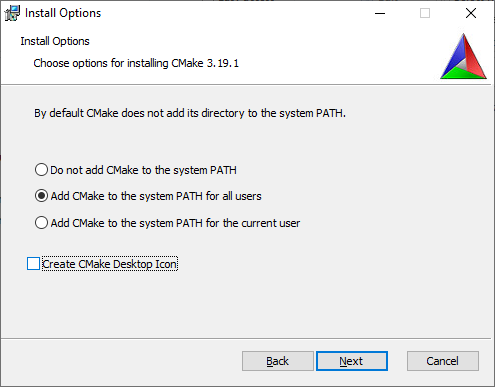
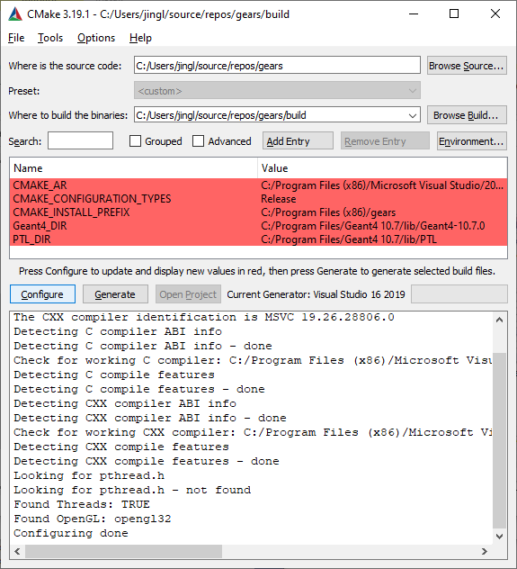
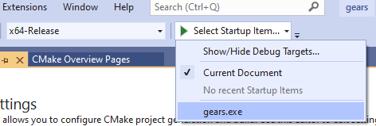
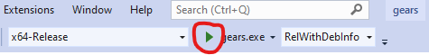
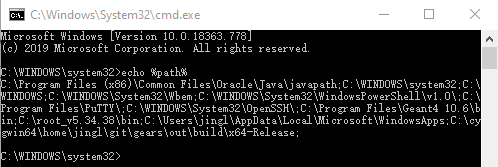
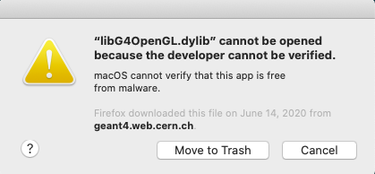
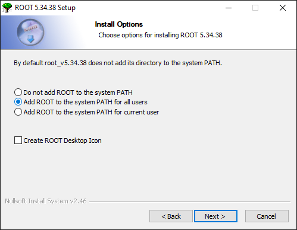

[](..)
[](#get-gears)
[](#compile-gears)
[](#install-gears)
[](#use-gears)
[](#install-geant4)
[](#install-root)

# Getting started

[GEARS][] can run in three major operating systems: [Windows](#compile-gears-in-windows), [macOS](#compile-gears-in-macos), and [Linux](#compile-gears-in-linux). It depends on [Geant4][]. If you don't have [Geant4][] installed yet in your system, please read section [Install Geant4](#install-geant4) first.

[GEARS]: https://github.com/jintonic/gears
[Geant4]: http://geant4.cern.ch

## Get GEARS
### Get GEARS in Windows
[GEARS][] can be downloaded as a `.zip` file from its [homepage](http://physino.xyz/gears) or [GitHub](https://github.com/jintonic/gears). Unpack it and that's it, you've got [GEARS][].

If you know how to use [Git][], you can download the whole [GEARS repository from GitHub][GEARS] using either [GitHub Desktop](https://desktop.github.com/) or [Visual Studio][]. If you use [Visual Studio][], go to section [Compile GEARS with Visual Studio](#compile-gears-with-visual-studio) for detailed instruction.

[Visual Studio]: https://visualstudio.microsoft.com/thank-you-downloading-visual-studio/?sku=Community

### Get GEARS in macOS or Linux
[GEARS][] can be downloaded as a `.tar.gz` or `.zip` file from its [homepage](http://physino.xyz/gears) or [GitHub](https://github.com/jintonic/gears). Run the following commands in your terminal to unzip it:

```sh
$ unzip gears-master.zip # if you downloaded the zip file
$ tar xfvz jintonic-gears-commitID.tar.gz # if you download the tar.gz file
$ mv jintonic-gears-commitID gears # rename the directory
```

If you know how to use [Git][], you can download the whole [GEARS repository from GitHub][GEARS]:

```sh
$ git clone https://github.com/jintonic/gears
```

This way, you can update your local copy from time to time using

```sh
$ cd /path/to/gears
$ git pull
```

Note that if you change some files in your local working copy, the `git pull` command will fail since [Git][] does not want to overwrite your local modification with the updated [GEARS][]. To avoid this, please copy [example macros](examples) to somewhere outside of the `gears/` directory. You can then modify them as you like without worry. An easy way to check if there is any local change that may block `git pull` is:

```sh
$ git status # show modified files
$ git diff a/changed/local/file # show what are changed
$ git checkout -- a/changed/local/file # discard the local change
$ git pull # get latest gears
```
[Git]: https://en.wikipedia.org/wiki/Git

## Compile GEARS

Two compilation systems are provide for [GEARS][]. One is [CMake][]. This mechanism is provided to insure that [GEARS][] can be compiled across platforms. You can find a [CMakeLists.txt](../CMakeLists.txt) file in the [GEARS][] folder, which can be detected automatically by [CMake][] in all platforms or [Visual Studio][] in Windows. The other method is to directly use a [Makefile](../Makefile) shipped with [GEARS][], which simplifies the compilation in Linux and macOS significantly.

[CMake]: https://cmake.org/

### Compile GEARS in Windows

First of all, you don't need to do this if you don't need any special features from [Geant4][], such as [GDML][] or [Qt][]. You can download [gears.exe](https://github.com/jintonic/gears/releases) directly from the [GEARS release page](https://github.com/jintonic/gears/releases), which is compiled with pre-compiled [Geant4][] libraries. If you have to compile it by yourself, here is how.

Please download [Visual Studio][] Community Edition installer. Run it. Choose to install a workload called "Desktop development with C++". It is about 2 GB and takes a long time to download and install. When you open VS the first time, choose "Visual C++" as your "Development Settings".

The compilation of GEARS can be done [solely with Visual Studio](#compile-gears-with-visual-studio). However, the process would become much easier if we use [CMake][] before using [Visual Studio][]. Please download and install [CMake][]. The only thing we need to pay attention during the installation is to "Add CMake to the system PATH":



Now we can run `CMake`, set "Where is the source code" to where [gears.cc](../gears.cc) is located, and "Where to build the binaries" to anywhere you like, but we prefer a new directory called `build` within the directory where [gears.cc](../gears.cc) is located:


Press the `Configure` bottom, you will be prompt to "Specify the generator for this project". `CMake` should be able to select [Visual Studio][] automatically. You just need to press the `Finish` bottom to confirm it:


Now, you should be able to see the following window:



If your [Geant4][] is installed correctly, `CMake` should be able to find it and set `Geant4_DIR` correctly. If not, you can still manually modify it in this window.

Now press `Generate` and then `Open Project`. [Visual Studio][] will be open automatically. If this is the first time you call [Visual Studio][] from within `CMake`, you may see the following window:


Press OK to confirm that you'd like to use [Visual Studio][] to open the `.sln` files created by `CMake`.

Inside [Visual Studio][], press the bottom shown in the following screenshot:


Upon a successful compilation, [Visual Studio][] will automatically run `gears.exe` for you:


You should also be able to run `gears.exe` anywhere you want since its containing directory has been added to the Windows `%PATH%` automatically by `CMake`.

#### Compile GEARS with Visual Studio

The compilation of GEARS can be done solely with Visual Studio. It is complicated, hence is not recommended. But here is how.

After opening [Visual Studio][], choose "Clone and checkout code":


Insert the [GEARS][] [GitHub](https://github.com/jintonic/gears) repository address `https://github.com/jintonic/gears.git` in the window below, and click `Clone`:


The default configuration of a new project in [Visual Studio][] 2019 is `x64-Debug` in a 64-bit Windows 10 machine. Choose in the pull down menu shown below `Manage Configurations...`:


Add `x64-Release` as the new CMakeSettings in the window below.


And delete `x64-Debug`.  The `x64-Debug` setting does not work.


Click on the save icon to save the new settings to a file called `CMakeSettings.json` in your local [GEARS][] folder:


In the following drop-down menu, select `gears.exe`:


And then press the green play button to compile [GEARS][]:


Upon a successful compilation, `gears.exe` will be automatically launched within [Visual Studio][]:


### Compile GEARS in Linux
[GEARS][] is shipped with a simple [Makefile](../Makefile). Simply type `make` to compile [gears.cc](../gears.cc) to generate a tiny executable `gears` in the GEARS directory:

```sh
$ cd /path/to/gears
$ make # compile gears.cc to generate executable: gears
```

### Compile GEARS in macOS

You need to have the [commandline tools for developers](https://osxdaily.com/2014/02/12/install-command-line-tools-mac-os-x/) installed before you can compile [GEARS][] in macOS. The command to install that is:

```sh
$ xcode-select --install
```

After this, the procedure is the same as [that in Linux](#compile-gears-in-linux).

## Install GEARS

### Install GEARS in Windows

If you compiled [GEARS][] using [CMake][] and then [Visual Studio][], you don't have to do anything extra, `gears.exe` has been installed automatically for you. If you only used [Visual Studio][] to compile [GEARS][], the executable `gears.exe` is located at `\path\to\gears\out\build\x64-Release\`. You need to add this folder to the Windows environment variable `path` so that you can use `gears.exe` in other directories. A batch file [gears.bat](gears.bat) is shipped with [GEARS][] to do this for you. Open the [GEARS][] folder in your file browser, copy `gears.bat` to `out\build\x64-Release`, right click on it, choose `Run as administrator` to run it. To check if it works, open a `cmd.exe` window and type `echo %path%` in it:



The path to `gears.exe` should show up at the end of the list.

### Install GEARS in macOS or Linux

After the compilation, the following message will be shown in your terminal:

```sh
$ cd /path/to/gears
$ make # compile gears.cc to generate executable: gears
 --------------------------------------------------------
 To install, please add the following line
    source /path/to/gears/gears.sh
 to ~/.bashrc in Linux or ~/.bash_profile in a Mac
 (or ~/.zshrc if you use zsh instead of bash)
 --------------------------------------------------------
```

Follow this instruction, open a new terminal when you are done, and you should be able to use the `gears` command in a new terminal now.

For Mac users, you need to use `~/.bash_profile` instead of `~/.bashrc`. Please check [this article](https://scriptingosx.com/2017/04/about-bash_profile-and-bashrc-on-macos/) for explanation. Alternatively, you can add `source ~/.bashrc` in your `~/.bash_profile` and still add `source /path/to/gears/gears.sh` to `~/.bashrc`.

If you use `zsh` instead of `bash`, use `~/.zshrc` instead of `~/.bashrc` or `~/.bash_profile`.

## Use GEARS

### User interface

[GEARS][] relies on [G4UIExecutive](http://geant4-userdoc.web.cern.ch/geant4-userdoc/UsersGuides/ForApplicationDeveloper/html/GettingStarted/graphicalUserInterface.html#how-to-select-interface-in-your-applications) to select a user interface (UI). Without any specific setup, [GEARS][] will try to run a graphic user interface (GUI) based on [Qt][] or Windows GUI. If your [Geant4][] is not compiled with GUI support, [GEARS][] will try to [use a command-line UI](http://geant4-userdoc.web.cern.ch/geant4-userdoc/UsersGuides/ForApplicationDeveloper/html/GettingStarted/graphicalUserInterface.html#g4uiterminal). In Windows, go to a folder where you'd like to run [GEARS][] in your file browser. Highlight the address bar, type `gears.exe`:


This will bring up the following GUI, which is simply a window to accept your macro commands:


In macOS or Linux, please run the following command to check if your [Geant4][] is compiled with [Qt][]:

```sh
$ geant4-config --help | grep qt
```

If the output is `qt[yes]`, then you should be able to use the [Qt][] based GUI. If you can't, please check if you set the environment variable `G4UI_USE_TCSH` somewhere:

```sh
$ env |grep G4UI
```

If yes, run `export G4UI_USE_QT=1` to overwrite the `G4UI_USE_TCSH` setting, and run `gears` again. It is optional to delete the latter, because if both variables are set, the latter will be ignored.

Now, if you want to go back to the command-line UI, you need to `unset G4UI_USE_QT` and keep the `G4UI_USE_TCSH` setting unchanged. `export G4UI_USE_QT=0` or `export G4UI_USE_QT=false` does not do what you intend to do. In fact, you can set `G4UI_USE_QT` to any value. It will take effect as long as it is not empty. The only way to completely get rid of it is to `unset` it.

If none of the environment variables is set, you can use `~/.g4session` to select your UI:

```sh
qt # the first line is for all Geant4 applications
gears tcsh # just for gears
```

[Qt]: https://doc.qt.io/

### Session mode

Without any argument, `gears` will start an [interactive session](http://geant4-userdoc.web.cern.ch/geant4-userdoc/UsersGuides/ForApplicationDeveloper/html/GettingStarted/graphicalUserInterface.html). It accepts [commands](http://geant4-userdoc.web.cern.ch/geant4-userdoc/UsersGuides/ForApplicationDeveloper/html/Control/commands.html) you type in the UI.

You can also put a set of commands into a [macro](examples) file, which can be used as an argument of `gears`. For example,

```sh
$ cd gears/examples/detector/visualization
$ gears RayTracer.mac # run gears in batch mode
```

This way, `gears` will run in the batch mode. It executes commands in the macro file one by one, and quit once it finishes.

In Windows, you can select a [Geant4][] macro file, right click on it, choose `Open with ...`, and then `Choose another app`, `More apps`, scroll down the list, choose `Look for another app in this PC` and navigate to the folder containing `gears.exe`, choose `gears.exe`. Now you can simply double click a [Geant4][] macro file to run it.

[GDML]: https://gdml.web.cern.ch/GDML/
[HDF5]: https://www.hdfgroup.org/downloads/hdf5/

# Install Geant4

[GEARS][] relies on [Geant4][]. Due to [some inconvenience in version 9](http://hypernews.slac.stanford.edu/HyperNews/geant4/get/hadronprocess/1242.html), a version above 9 is requested. Optionally, the following two packages can be installed before [Geant4 installation]():
* (Optional) [Xerces-C++](https://xerces.apache.org/xerces-c/), to use or export detector geometries in [GDML][] format.
* (Optional) [HDF5][], to save simulation results in [HDF5][] format.

Before you get started, please understand that the [Geant4 Installation Guide](https://geant4-userdoc.web.cern.ch/geant4-userdoc/UsersGuides/InstallationGuide/html/) is your ultimate reference should you have any issue regarding [Geant4][] installation, and the Geant4 [User Forum](https://geant4-forum.web.cern.ch/) is the place to seek for help. You also need to be aware of [the possibility of installing pre-comipled Geant4 libraries](https://www.youtube.com/watch?v=fu3NLgb0fwI) in some OS, which would save you hours of time and potential headaches.

## Which OS should you use for Geant4 simulation?
**Short Answer:** The one you are using right now. Technically, Geant4 works fine in Windows, Linux and MacOS.

**Long Answer:** It depends, on

- whom you can ask for help from. If everybody around you uses Linux or Mac and trashes Windows, join them. You don't have to trash anything, but it is a great opportunity for you to learn something different from them. The competition among these three OS keeps pushing them all to get better. Open your mind to different ways of doing things.
- what you do with Geant4. If you need to accumulate a lot of statistics, a single PC is not enough. Most probably, you need submit hundreds of simulation jobs to a CPU farm, which mostly runs in Linux. If your simulation is simple, a laptop is more convenient.

**Pro's and con's of Windows:**
It is very easy to install a pre-compiled Geant4 on Windows with just a few clicks, which saves hours in compilation or debugging in case of a failed compilation. However, the packaging of Geant4 is not complete in Windows, quite a few post-installation setups are needed, which are covered in detail [here](#install-pre-compiled-geant4-in-windows). It is absolutely possible to compile Geant4 by yourself in a Windows PC. The detail is covered in [this YouTube video](https://www.youtube.com/watch?v=GykiM1lPON4).

**Pro's and con's of Linux:**
The pre-compiled Geant4 is only [provided for a single Linux distribution with a perticular compiler](#install-pre-compiled-geant4-in-centos), which are not the popular ones. You need to be quite familiar with the commandline inferface to compile and use Geant4 in Linux, which takes time. However, most likely you may need this knowledge if you have to do some large simulation in a CPU farm.

**Pro's and con's of MacOS:**
MacOS has the pro's and con's from both Windows and Linux. It is very easy to install a pre-compiled Geant4 in a Mac with just a few clicks, which saves hours in compilation or debugging in case of a failed compilation. However, quite a few post-installation twicks are needed, which are covered in detail [here](#install-pre-compiled-geant4-in-macos). If you decide to compile Geant4 by yourself in a Mac, you need to be quite familiar with the commandline inferface, which takes time to learn.

## Install pre-compiled Geant4 in Windows
[](https://www.youtube.com/watch?v=LkbzMiOixug)

Download pre-compiled Geant4 in Windows 10 from <https://geant4.web.cern.ch/support/download>. When you double click it to install it, Windows will pop a window "Windows protected your PC". Select "More info" and then "Run anyway". Now simply follow the instruction till the end, except for the following step, where you need to choose "Add Geant4 to the system PATH for all users" or "current user":


A few more steps need to be done before you can start to use your [Geant4][]. They are covered in the [Geant4 Installation Guide](http://geant4-userdoc.web.cern.ch/geant4-userdoc/UsersGuides/InstallationGuide/html/postinstall.html#required-environment-settings-on-windows). Basically, you need to download [Geant4][] data files from <http://geant4.web.cern.ch/support/download>, unpack them into a directory, for example, `C:\Program Files\Geant4 10.6\share\Geant4-10.6.2\data`, and then [set environment variables](http://geant4-userdoc.web.cern.ch/geant4-userdoc/UsersGuides/InstallationGuide/html/postinstall.html#required-environment-settings-on-windows) to point to the database directories. This is a very tedious process. You can download [a windows batch file](https://en.wikipedia.org/wiki/Batch_file), [GEARS/install/geant4.bat](geant4.bat), save it to the SAME folder where the Geant4 datasets are saved, select it and then right click on it, choose "Run as administrator" to run it. To check if it runs successfully, press the `windows` key on your keyboard, search for `view advanced system settings` and type <kbd>Enter</kbd> to bring up the following window:


Click "Environment Variables..." and check the highlighted items to make sure that your Geant4 installation folder is included in the `Path` and every data folder is associated with a environment variable:


## Install pre-compiled Geant4 in macOS

You can download the pre-compiled Geant4 libraries for the macOS [here](https://geant4.web.cern.ch/support/download). By default, it will be saved to `~/Downloads`. The next step is to download [Geant4 datasets](https://geant4.web.cern.ch/support/download) one by one and unpack them into a folder. This tedious process can be automated by using the [geant4-config][] script shipped with [Geant4][]. However, the one shipped with the pre-compiled [Geant4][] does not know where your data folder is. You need to run the following commands to update your [geant4-config][] and use it to install all the datasets for you:

```sh
$ cd ~/Downloads/Geant4-10.6.2-Darwin/bin
# change location of geant4 databases
$ sed -i.bak 's|/Users/gcosmo/Software/release/install|'${HOME}'/Downloads/Geant4-10.6.2-Darwin|g' geant4-config
$ ./geant4-config --install-datasets
```

By default, macOS does not allow you to run Geant4 libraries in `~/Downloads/Geant4-10.6.2-Darwin/lib`. The first time you run a Geant4 executable that calls some of the libraries, you will get a pop-up window like this:



You have to follow the instruction [here](https://github.com/Jackett/Jackett/issues/5589) to make the exception:

```sh
$ cd ~/Downloads/Geant4-10.6.2-Darwin/lib
$ xattr -p com.apple.quarantine libG4run.dylib
0081;5e968234;Firefox;29504EDE-15EA-4CF5-A750-6B0AEB8CF5ED
# copy the output and change the first 4 letters from 0081 to 00c1:
$ xattr -w com.apple.quarantine "00c1;5e968234;Firefox;29504EDE-15EA-4CF5-A750-6B0AEB8CF5ED" libG3*.dylib
$ xattr -w com.apple.quarantine "00c1;5e968234;Firefox;29504EDE-15EA-4CF5-A750-6B0AEB8CF5ED" libG4*.dylib
```

Add the following to `~/.bash_profile` (or `~/.zshrc` if you use zsh) to finish the post-installation setup:

```sh
export G4SYSTEM=Darwin-clang
# add Geant4-xxx/bin/ to PATH
export G4INSTALL=~/Downloads/Geant4-10.6.2-Darwin
export PATH=$G4INSTALL/bin/:$PATH
# add Geant4 libs to DYLD_LIBRARY_PATH
G4LIB=`geant4-config --libs | awk '{print $1}'`
export G4LIB=${G4LIB#-L}
export DYLD_LIBRARY_PATH=$G4LIB:$DYLD_LIBRARY_PATH
# set Geant4 database locations
while read line; do
  database=`echo $line | awk '{print $2}'`
  folder=`echo $line | awk '{print $3}'`
  export $database=$folder
done <<< "$(geant4-config --datasets)"
```

If you encounter problems to load some shared libraries when you run a Geant4 executable, for example, `libXmu.6.dylib`, check its location in `libG4OpenGL.dylib` using:

```sh
# print shared libraries used in a library file
$ otool -L libG4OpenGL.dylib
libG4OpenGL.dylib:
...
/opt/X11/lib/libXext.6.dylib (compatibility version 11.0.0, current version 11.0.0)
/opt/local/lib/libXmu.6.dylib (compatibility version 9.0.0, current version 9.0.0)
/opt/X11/lib/libGL.1.dylib (compatibility version 4.0.0, current version 4.0.0)
...
```

and then use the following trick to solve the problem:

```sh
# make a link in the location appeared in the library file
$ sudo mkdir -p /opt/local/lib
$ cd /opt/local/lib
$ sudo ln -sf /opt/X11/lib/libXmu.6.dylib
```

If you have problems to run `cmake` in some of the official Geant4 examples, check if all variables in `~/Download/Geant4-10.x.x-Darwin/lib/Geant4-10.x.x/Geant4PackageCache.cmake` are set correctly. The following variables may be different from what are actually in your system:

- EXPAT_INCLUDE_DIR, EXPAT_LIBRARY
- X11_Xmu_INCLUDE_PATH, X11_Xmu_LIB
- OPENGL_INCLUDE_DIR, OPENGL_gl_LIBRARY, OPENGL_glu_LIBRARY

Manually fix them based on your system and you should be able to run `cmake` and `make` for your Geant4 examples. Note that, this has no effect on GEARS compilation since GEARS relies on `geant4-config` instead of the Geant4 Cmake files for its compilation.

## Install pre-compiled Geant4 in CentOS

You can download the pre-compiled Geant4 libraries for CentOS [here](https://geant4.web.cern.ch/support/download). They were compiled with a relatively new version of `g++`, 8.3.0. Run the following command in your CentOS terminal:

```sh
$ g++ --version
```

If your g++ is much older than the version used for the pre-compiled libraries, please stop here. You may not be able to use the pre-compiled libraries due the mismatch of the compilers.

Otherwise, unpack the downloaded gz file to a directory that you like:

```sh
$ cd /path/to/your/Linux-g++8.3.0-CC7.tar.gz
$ tar xfvz Linux-g++8.3.0-CC7.tar.gz
$ ls
./   ../   Geant4-10.6.2-Linux/
```

The next step is to download [Geant4 datasets](https://geant4.web.cern.ch/support/download) one by one and unpack them into a folder. This tedious process can be automated by using the [geant4-config][] script shipped with [Geant4][], which can be found in `/path/to/your/geant4/bin/`.  However, the one shipped with the pre-compiled [Geant4][] does not know where your data folder is. You need to run the following commands to update your [geant4-config][] and use it to install all the datasets for you:

```sh
$ cd /path/to/your/Geant4-10.6.2-Linux/bin
# change location of geant4 databases
$ sed -i.bak 's|/afs/cern.ch/user/g/gunter/l/releases/web/10.6.p01/install|/path/to/your/geant4|g' geant4-config
$ ./geant4-config --install-datasets
```

A bash script [gears.sh](../gears.sh) is provided in [GEARS][] to find the location of the Geant4 datasets. Add the following to your `~/.bashrc` (or `~/.zshrc` if you use zsh) to finish the post-installation setups:

```sh
source /path/to/your/pre-compiled/geant4/bin/geant4.sh
# source gears/gears.sh to export Geant4 database locations
source /path/to/gears/gears.sh
```

# Install ROOT

[ROOT][] is NOT needed to compile or run [GEARS][] even though the default output file format is in [ROOT][]. It is not even needed for the analysis of the output file, instead, one can use [uproot][] to read the file in [Python][]. However, it is very convenient to analyze the [GEARS][] output data in a [ROOT][] interactive session using [TTree::Draw](examples/output/#data-analysis). The compilation of [ROOT][] takes a long time. However, installation of pre-compiled [ROOT][] libraries is very easy.

## Install pre-compiled ROOT in Windows
Some [manual modifications](https://root-forum.cern.ch/t/windows-install-issue-with-root-version-618-02/35773/7) have to be done after installing pre-compiled ROOT in version 6. If you don't mind, install version 5 instead. It works right after the installation. Old ROOT releases can be found at <https://root.cern.ch/releases>. In the installation, please don't forget to make the following choice:



## Install pre-compiled ROOT in macOS

Download pre-compiled ROOT for macOS from <https://root.cern.ch/downloading-root>. If you download the `.pkg` version, simply double click on the file to install it to `/Applications/` directory and then add the following to your `~/.bash_profile` (or `~/.zshrc` if you use `zsh`):

```sh
export ROOTSYS=/Applications/root_v6.20.04
export PATH=$ROOTSYS/bin:$PATH
export DYLD_LIBRARY_PATH=$ROOTSYS/lib:$DYLD_LIBRARY_PATH
```

Save and quit, open a new terminal, and you should be able to run the `root` command in that new terminal.

If you encounter some error messages related to `/Library/Developer/CommandLineTools`, you need to use the following command to install [command line tools for developers](https://osxdaily.com/2014/02/12/install-command-line-tools-mac-os-x/):

```sh
$ xcode-select --install
```

and then try to run `root` again.

## Install pre-compiled ROOT in Linux
Download pre-compiled ROOT for your Linux distribution from <https://root.cern.ch/downloading-root>, for example:

```sh
# download ROOT package
$ wget https://root.cern/download/root_v6.20.04.Linux-ubuntu19-x86_64-gcc9.2.tar.gz
# unpack it to the current directory
$ tar xfvz root_v6.20.04.Linux-ubuntu19-x86_64-gcc9.2.tar.gz
```

Add the following to your `~/.bashrc` (or `~/.zshrc` if you use `zsh`):

```sh
export ROOTSYS=/path/to/root
export PATH=$ROOTSYS/bin:$PATH
export LD_LIBRARY_PATH=$ROOTSYS/lib:$LD_LIBRARY_PATH
```

Save and quit, open a new terminal, and you should be able to run the `root` command in that new terminal.

[ROOT]: https://root.cern.ch
[uproot]: https://github.com/scikit-hep/uproot
[Python]: https://www.python.org/
[Geant4-config]: http://geant4-userdoc.web.cern.ch/geant4-userdoc/UsersGuides/InstallationGuide/html/buildtools.html#other-unix-build-systems-geant4-config
