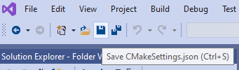

## Compile GEARS with Visual Studio

The compilation of GEARS can be done solely with Visual Studio. It is complicated, hence is not recommended. But here is how.

After opening [Visual Studio][], choose "Clone and checkout code":

Insert the [GEARS][] [GitHub](https://github.com/jintonic/gears) repository address `https://github.com/jintonic/gears.git` in the window below, and click `Clone`:

The default configuration of a new project in [Visual Studio][] 2019 is `x64-Debug` in a 64-bit Windows 10 machine. Choose in the pull down menu shown below `Manage Configurations...`:

Add `x64-Release` as the new CMakeSettings in the window below.

And delete `x64-Debug`.  The `x64-Debug` setting does not work.

Click on the save icon to save the new settings to a file called `CMakeSettings.json` in your local [GEARS][] folder:

In the following drop-down menu, select `gears.exe`:

And then press the green play button to compile [GEARS][]:

Upon a successful compilation, `gears.exe` will be automatically launched within [Visual Studio][]:

If you compiled [GEARS][] using [CMake][] and then [Visual Studio][], you don't have to do anything extra, `gears.exe` has been installed automatically for you. If you only used [Visual Studio][] to compile [GEARS][], the executable `gears.exe` is located at `\path\to\gears\out\build\x64-Release\`. You need to add this folder to the Windows environment variable `path` so that you can use `gears.exe` in other directories. A batch file [gears.bat](gears.bat) is shipped with [GEARS][] to do this for you. Open the [GEARS][] folder in your file browser, copy `gears.bat` to `out\build\x64-Release`, right click on it, choose `Run as administrator` to run it. To check if it works, open a `cmd.exe` window and type `echo %path%` in it:

The path to `gears.exe` should show up at the end of the list.

[GEARS]: https://github.com/jintonic/gears
[CMake]: https://cmake.org
[Visual Studio]: https://visualstudio.microsoft.com
