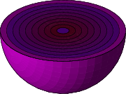

[](../../..)
[](../..)
[](..)

## Create text geometry using SHELL script

[tracker.sh](tracker.sh) is an example shell script to create a [text geometry][tg] file `tracker.tg`, which is used in [bend.mac](bend.mac)

```sh
$ ./tracker.sh # create tracker.tg
$ gears bend.mac # create tracker.png
```

You need to have [dawn][] installed to convert the output `g4_0000.prim` to `g4_0000.eps`, and to have [convert][] command available to convert `g4_0000.eps` to `tracker.png`:


[LINEAR_X.tg](LINEAR_X.tg) shows another way to create the same geometry. The problem of this approach is that the copy number cannot start with any number other than 0.

[onion.sh](onion.sh) is an another example shell script to create a [text geometry][tg] file `onion.tg`, which is used in [onion.mac](onion.mac)

```sh
$ ./onion.sh # create onion.tg
$ gears onion.mac # create onion.png
```

It demonstrate how to place a smaller solid directly inside a bigger one. The final result looks like this:



[tg]: http://geant4-userdoc.web.cern.ch/geant4-userdoc/UsersGuides/ForApplicationDeveloper/html/Detector/Geometry/geomASCII.html
[dawn]:https://geant4.kek.jp/~tanaka/DAWN/About_DAWN.html
[convert]:https://imagemagick.org/script/convert.php
