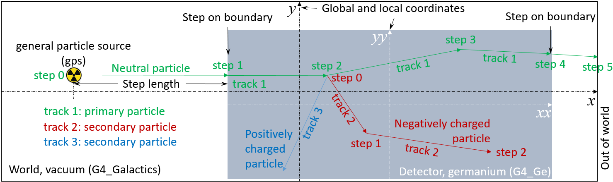

[](../..)
[](..)
[](#step-point)
[](#total-energy)
[](#data-analysis)

## Output
Generally speaking, the [visualization](../detector/#detector-visualization) of [detector](../detector) [geometry](../detector/#detector-construction) and the [screen dump](#screen-dump) of a [Geant4][] application can be all regarded as output of a [Geant4][] simulation. Strictly speaking, the output of a [Geant4][] simulation includes [histograms][] and/or [ntuples][] of [data][] generated during the simulation, which can be used to reveal statistical distributions of, for example, positions and energy depositions of interactions.

[GEARS][] utilizes [Geant4 analysis managers]({{site.g4doc}}/Analysis/managers.html) to provide four output formats: [ROOT][] (default), [HDF5][], CSV, and [AIDA][] XML. The output file format can be chosen using the following command:

~~~sh
$ make hdf5 # create ghdf5.cc from gears.cc
$ make # compile ghdf5.cc
~~~

The output file name can be chosen using the macro command:

~~~
/analysis/setFileName output
~~~

No suffix is needed for the file name. Note that the **output is disabled by default**. It will be enabled if the output file name is not empty. So this macro command also works as a switch. Without it, no output file will be created.

[Geant4]: http://geant4.cern.ch
[histograms]:https://www.khanacademy.org/math/ap-statistics/quantitative-data-ap/histograms-stem-leaf/v/histograms-intro
[ntuples]:https://en.wikipedia.org/wiki/Tuple
[data]:#step-point
[ROOT]:https://root.cern.ch
[HDF5]: https://www.hdfgroup.org/downloads/hdf5/
[AIDA]: http://aida.freehep.org/index.thtml
[GEARS]: http://physino.xyz/gears

### Screen dump

[Geant4][] can print out on screen detailed information of a simulation if you increase the verbose level of tracking using the macro command [/tracking/verbose]({{site.g4doc}}/Control/AllResources/Control/UIcommands/_tracking_.html), for example,

```sh
 # turn on detailed information about tracking
 /tracking/verbose 2
 # run a few events for debugging
 /run/beamOn 10
 # turn off screen dump for fast simulation
 /tracking/verbose 0
 # run a lot of events
 /run/beamOn 100000
```

You can re-direct the screen dump to a file for detailed examination:

```sh
$ gears macro.mac | tee log
$ less log
```

### ROOT

The [ROOT][] version of [ntuples][] is [TTree][], which is commonly called a **tree**. Simply put, a tree is a table. Each row is called an entry (or an event) and each column is called a branch (of course, we are dealing with a tree after all). If you simulate 1000 events using [GEARS][], your [ROOT][] tree would have 1000 entries. If you save the first interaction position `x`, `y`, and `z` in the tree, your tree would have 3 branches, each holds 1000 values of `x`, `y`, or `z`. If an event has more than just one hit, you will have a few `x`, `y`, and `z`'s for each event (row), and your table would have one more dimension, labeled as `Iteration$` in [TTree][], the depth of which may change event by event since each event may have a different number of hits.

The [ROOT][] [TTree][] offers the following features that are desired for analyzing data generated by [GEARS][]:

- It is designed to work with large data sets. For example, it can deal with Terra Bytes of data easily. It does so by loading individual branches separately to a PC memory for analysis, which requires relatively small memory compared to loading the whole table as many other analysis tools do.
- It compresses data to save disk space.
- It provide [functions][] to create and analyze statistical distributions of data using multiple dimensional [histograms][].

[TTree]:https://root.cern.ch/doc/master/classTTree.html
[functions]:https://root.cern.ch/doc/master/classTTree.html#a8a2b55624f48451d7ab0fc3c70bfe8d7

Here are some example codes that can be run in a ROOT interactive session to generate histograms:

```cpp
$ root output.root # open the output file in root format using ROOT
root [] .ls
TFile**         output.root
 TFile*         output.root
   KEY: TTree    t;1     Geant4 step points
root [] t->GetEntries()
(long long) 5000
root [] t->Show(0)
======> EVENT:0
 n   = 235
 m   = 2
 trk = (vector<int>*)0x351a520
 stp = (vector<int>*)0x398c7b0
 vlm = (vector<int>*)0x2d4dba0
 pro = (vector<int>*)0x3524f60
 pdg = (vector<int>*)0x34302c0
 mom = (vector<int>*)0x3972e80
 k   = (vector<double>*)0x3a907c0
 p   = (vector<double>*)0x2a307c0
 t   = (vector<double>*)0x351eed0
 x   = (vector<double>*)0x2d50760
 y   = (vector<double>*)0x351a450
 z   = (vector<double>*)0x3543f10
 l   = (vector<double>*)0x2f636f0
 dl  = (vector<double>*)0x2f63630
 de  = (vector<double>*)0x34b2d90
 t0  = (vector<double>*)0x3549db0
 x0  = (vector<double>*)0x3548ce0
 y0  = (vector<double>*)0x2d4ef10
 z0  = (vector<double>*)0x354e600
 et  = (vector<double>*)0x35293f0
root [] t->Draw("x","e*(pdg==2)")
```

## Step point

[Geant4][] tracks a particle step by step as it passes through the [simulated world](../detector) until it goes out of it, gets absorbed in a material, or changes to other particles, as shown in the following figure. A step point is a point in a particle track where the particle is generated or changed.



[Geant4][] artificially adds a step point on the boundary of two volumes when the track goes from one volume into the other, even if there is no change of the particle.

A step point in [GEARS][] contains the following information:

* Track id (`trk` in short)
* Step number, starting from 0  (`stp` in short)
* Detector volume copy number (`vlm` in short)
* [Process id](#process-id) (`pro` in short)
* [Particle id](#particle-id) (`pdg` in short)
* Particle id of the parent particle (`mom` in short)
* Energy deposited [keV] (`de` in short)
* Kinetic energy of the particle [keV] (`k` in short)
* Momentum of the particle [keV] (`p` in short)
* Global time `t0` [ns]
* Global position `x0` [mm] (origin: center of the world)
* Global position `y0` [mm] (origin: center of the world)
* Global position `z0` [mm] (origin: center of the world)
* Local time `t` [ns]
* Local position `x` [mm] (origin: center of the volume)
* Local position `y` [mm] (origin: center of the volume)
* Local position `z` [mm] (origin: center of the volume)


They are saved in separated C++ vectors (arrays with various sizes). Such a flat data structure and very short variable names are chosen on purpose to make plotting of those variables in a [ROOT][] interactive session easy.

Notice that the variable `n` is the total number of step points recorded in each event. `m` is the maximal copy number of a [sensitive volume](../detector#sensitive-volume)

### Process id

The physics process generating each step point is saved in a variable `pro[n]`, where `n` is the index of the step point. It equals to (process type) * 1000 + (sub type). The Process types are defined in G4ProcessType.hh, sub types are defined in G4HadronicProcessType.hh, G4DecayProcessType.hh, G4EmProcessSubType.hh,  G4TransportationProcessType.hh, G4FastSimulationProcessType.hh, G4OpProcessSubType.hh, etc. They can be found in <http://www-geant4.kek.jp/lxr/find?string=Type.hh>.

- less than 1000: not defined
- 1000 to 2000: transportation
  - 1091: transportation
- 2000 to 3000: electromagnetic
  - 2001: Coulomb scattering
  - 2002: ionization
  - 2003: Bremsstrahlung
  - 2004: pair production by charged particles
  - 2005: annihilation
  - 2010: multiple scattering
  - 2011: Rayleigh scattering
  - 2012: photoelectric effect
  - 2013: Compton scattering
  - 2014: gamma conversion (pair production)
  - 2021: Cherenkov
  - 2022: scintillation
  - 2023: syncrhotron radiation
- 3000 to 4000: optical
- 4000 to 5000: hadronic
  - 2111: hadron elastic
  - 2121: hadron inelastic
  - 2131: capture
  - 2132: muon atomic capture
  - 2141: fission
  - 2151: hadron at rest
  - 2142: lepton at rest
  - 2161: charge exchange
  - 2210: radioactive decay
- 5000 to 6000: photolepton_hadron
- 6000 to 7000: decay
- 7000 to 8000: general
- 8000 to 9000: Parameterisation
- 9000 to 10000: user defined
- 10000 to 11000: parallel
- 11000 to 12000: phonon
- 12000 to 13000: UCN

### Particle id

The type of particle related to a step point is saved in a variable `pdg[n]`. It is the same as the [PDG encoding](http://pdg.lbl.gov/current/mc-particle-id) of the particle. A Google search will give more information about it.

### Record information of step 0

One cannot get access to step 0 (initStep printed on screen if `/tracking/verbose` is set to be more than 0) through [G4UserSteppingAction][], which only provides access to step 1 and afterwards. However, step 0 contains some very important information that is constantly requested by the user. For example, the energy of a gamma ray from a radioactive decay is only available from step 0. Such information can be easily displayed using the following ROOT command with the Output ROOT tree, `t`:

~~~cpp
  // draw kinetic energy, "k", of a gamma (pdg==22)
  // created by radioactive decay process (pro==6210)
  t->Draw("k","pro==6210 && pdg==22")
~~~

This is achieved by using [G4SteppingVerbose][] instead of [G4UserSteppingAction][] for data recording. The former provides a function called [TrackingStarted][]() to print verbose information about step 0 on screen if `/tracking/verbose` is set to be more than 0. It also provides a function called [StepInfo][]() to print verbose information about steps after step 0 on screen if `/tracking/verbose` is more than 0. [G4SteppingVerbose][]::[StepInfo][]() is called right before [G4UserSteppingAction][]::[UserSteppingAction][]([G4Step][]*) is called in [G4SteppingManager][]::[Stepping][](), it hence can be used to fully replace the functionality of [G4UserSteppingAction][]::[UserSteppingAction][]([G4Step][]*).

In fact, [G4UserSteppingAction][]::[UserSteppingAction][]([G4Step][]*) is not used at all in [GEARS][]. The Output class inherits [TrackingStarted][]() and [StepInfo][]() from [G4SteppingVerbose][] to record data from all steps. There is another advantage of using [G4SteppingVerbose][] instead of [G4UserSteppingAction][] for recording, that is, [G4SteppingVerbose][] is provided as a globally available singleton, which can be easily accessed at different places in the codes using:

~~~cpp
  G4VSteppingVerbose::GetInstance()
~~~

This is used in [G4UserRunAction][] to open and close a TFile, in [G4UserEventAction][] to fill a TTree.

The catch is that functions in [G4SteppingVerbose][] will not be called in [G4SteppingManager][] unless `/tracking/verbose` is set, which will print too much information on screen for a long run. This is solved in EventAction::BeginOfEventAction by turning on tracking verbose all the time so that all functions in [G4SteppingVerbose][] will be called, while at the same time, turning on [G4SteppingVerbose][] local verbose flag [Silent][] to run them in silent mode.

[G4Track]: http://www-geant4.kek.jp/lxr/source/track/include/G4Track.hh
[G4Step]: http://www-geant4.kek.jp/lxr/source/track/include/G4Step.hh
[G4UserSteppingAction]:http://www-geant4.kek.jp/lxr/source/tracking/include/G4UserSteppingAction.hh
[UserSteppingAction]:http://www-geant4.kek.jp/lxr/source/tracking/include/G4UserSteppingAction.hh
[G4SteppingVerbose]: http://www-geant4.kek.jp/lxr/source/tracking/include/G4SteppingVerbose.hh
[G4SteppingManager]: http://www-geant4.kek.jp/lxr/source/tracking/include/G4SteppingManager.hh
[G4UserRunAction]: http://www-geant4.kek.jp/lxr/source/run/include/G4UserRunAction.hh
[G4UserEventAction]: http://www-geant4.kek.jp/lxr/source/event/include/G4UserEventAction.hh
[Silent]: http://www-geant4.kek.jp/lxr/source/tracking/src/G4VSteppingVerbose.cc#L50
[Stepping]: http://www-geant4.kek.jp/lxr/source/tracking/src/G4SteppingManager.cc#L116
[StepInfo]: http://www-geant4.kek.jp/lxr/source/tracking/src/G4SteppingManager.cc#L228
[TrackingStarted]: http://www-geant4.kek.jp/lxr/source/tracking/src/G4SteppingManager.cc#L360

## Total energy
In addition to arrays of parameters of individual step points, a [GEARS][] output file also contains an array of the total energies deposited in the [sensitive volumes](../detector#sensitive-volume) of the simulated detector. The index of the array is the same as the copy numbers of those volumes. The name of the array is called `et`. Since the copy number of a [sensitive volume](../detector#sensitive-volume) has to start from 1, `et[0]` is used to store the total energy deposited in all sensitive volumes. You can use the following command to draw the total energy deposited in a sensitive volume with a copy number `1`:

```cpp
root [] t->Draw("et[1]")
```
## Data analysis

One can use the following command to generate `output.root` in [GEARS][]/[examples](..)/[output]({{site.file}}/examples/output)/:

```sh
$ gears radiate.mac
```

[radiate.mac]({{site.file}}/examples/output/radiate.mac) demonstrates how to use [Geant4][] [macro commands]({{site.g4doc}}/Control/AllResources/Control/UIcommands/_.html) to save [step points](#step-point) and [total energies in sensitive volums](#total-energy). It uses the [detector geometry](../detector) defined in [detector.tg]({{site.file}}/examples/output/detector.tg).

Here are some sample [ROOT][] commands that one can use to generate plots from `output.root`:

```cpp
// draw tracks of the primary particle on x-y plane in event 1
root[] t->Draw("x0:y0", "trk==1","l", 1, 1)
// show physics processes creating secondary particles
root[] t->Draw("pro","trk>1 && stp==0")
// display hits distribution in volume with copy number 1
root[] t->Draw("x:y:z", "vlm==1")
// show how many types of particles are involved in the simulation
root[] t->Draw("pdg");
// show physics process related to gamma-rays
root[] t->Draw("pro", "pdg==22 && stp!=0");
// show spatial distributions of secondary particles created by the primary one
root[] t->Draw("x0:y0", "mom==1")
// plot dE/dx versus momentum
root[] t->Draw("de/dl:p")
// draw energy spectrum recorded by volume (detector) 1
root[] t->Draw("et[1]")
```
