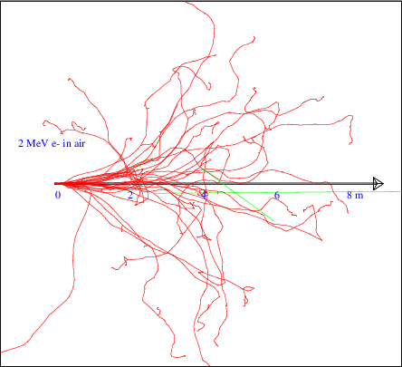

[](../../..)
[](../..)
[](..)

## Beta interactions

Beta particles are electrons. As shown in the following plot taken from the review article [Passage of Particles Through Matter][review] in [PDG][], electrons lose their energies in matter primarily through ionizing atoms around them (Geant4 name: **eIoni**, [GEARS process id](../../output#process-id): 2002) below 10 MeV. More energetic electrons are more likely to generate photons through [Bremsstrahlung][] (Geant4 name: **eBrem**, [GEARS process id](../../output#process-id): 2003). Multiple scattering with orbiting electrons (Geant4 name: **msc**, [GEARS process id](../../output#process-id): 2010) is a subdominant way for an electron to lose energy.


[review]: https://pdg.lbl.gov/2020/reviews/rpp2020-rev-passage-particles-matter.pdf
[PDG]: https://pdg.lbl.gov
[Bremsstrahlung]: https://en.wikipedia.org/wiki/Bremsstrahlung

The following figure shows a few tens of 2 MeV electrons flying through the air. Green lines are photons generated by some of them through [Bremsstrahlung][]. It is generated by running

```sh
$ cd /path/to/gears/examples/physics/beta
$ gears air.mac
```

The contents of the macro file [air.mac](air.mac) can be viewed online [here](air.mac).


