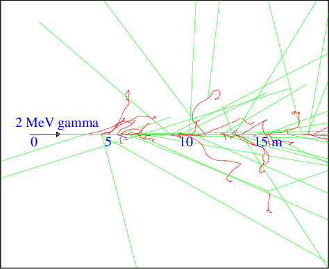

[](../../..)
[](../..)
[](..)

## X and Gamma-ray interactions

X and gamma-rays interact with matter mainly through three processes:

- [Photoelectric effect][] (Geant4 name: **phot**, [GEARS process id](../../output#process-id): 2012)
- [Compton scattering][] (Geant4 name: **compt**, [GEARS process id](../../output#process-id): 2013)
- [Pair production][] (Geant4 name: **conv**, [GEARS process id](../../output#process-id): 2014)

The following plot shows their relative significance in aluminum in different energy ranges. At low energy, the photoelectric effect is dominent. Around MeV, Compton scattering is dominent. Above 10 MeV, pair production is dominent.


[Photoelectric effect]: https://en.wikipedia.org/wiki/Photoelectric_effect
[Compton scattering]: https://en.wikipedia.org/wiki/Compton_scattering
[Pair production]: https://en.wikipedia.org/wiki/Pair_production

The following figure shows a few hundreds of 2 MeV gamma-rays flying through the air. Red curly lines are electrons created in the interactions listed above. The figure is generated by running

```sh
$ cd /path/to/gears/examples/physics/gamma
$ gears air.mac
```

The contents of the macro file [air.mac](air.mac) can be viewed online [here](air.mac).


