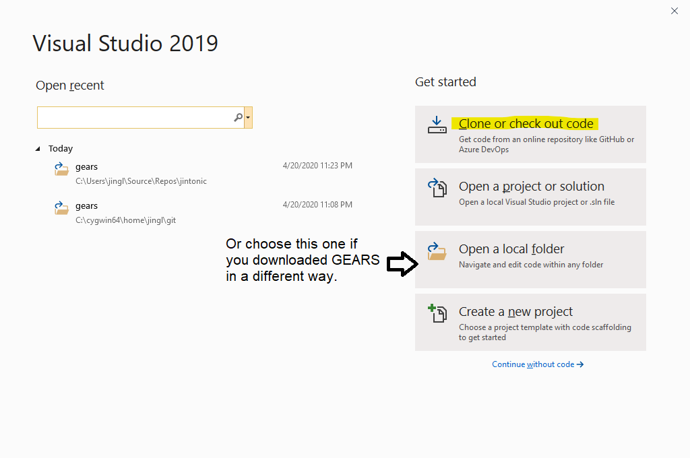
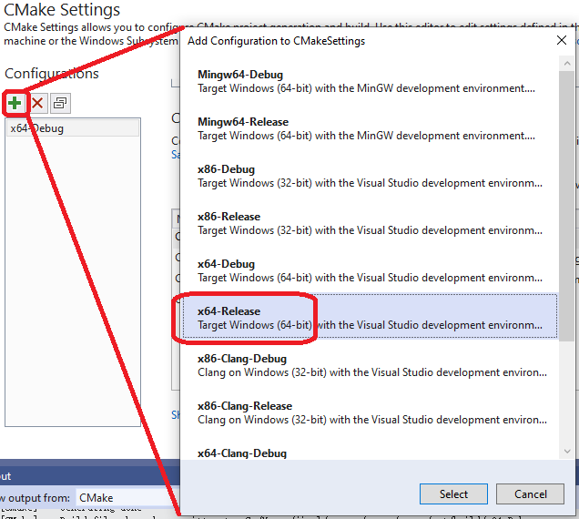
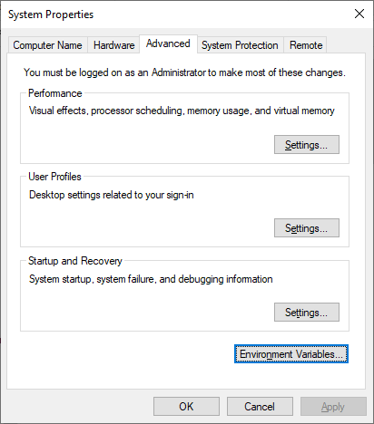

[](..)
[](#get-gears)
[](#compile-gears)
[](#install-gears)
[](#use-gears)
[](#install-geant4)
[](#install-root)

# Getting started

[GEARS][] can run in three major operating systems: [Windows](#compile-gears-with-visual-studio), [macOS](#compile-gears-in-macos-or-linux), and [Linux](#compile-gears-in-macos-or-linux). It depends on [Geant4][]. If you don't have [Geant4][] installed yet in your system, please read section [Install Geant4](#install-geant4) first.

[GEARS]: https://github.com/jintonic/gears
[Geant4]: http://geant4.cern.ch

## Get GEARS
[GEARS][] can be downloaded as a `.tar.gz` or `.zip` file from its [homepage](http://physino.xyz/gears) or [GitHub](https://github.com/jintonic/gears). In Linux, run the following commands to unzip it:

```sh
$ unzip gears-master.zip # if you downloaded the zip file
$ tar xfvz jintonic-gears-commitID.tar.gz # if you download the tar.gz file
$ mv jintonic-gears-commitID gears # rename the directory
```

If you know how to use [Git][], you can download the whole [GEARS repository from GitHub][GEARS]:

```sh
$ git clone https://github.com/jintonic/gears
```

This way, you can update your local copy from time to time using

```sh
$ cd /path/to/gears
$ git pull
```

Note that if you change some files in your local working copy, the `git pull` command will fail since [Git][] does not want to overwrite your local modification with the updated [GEARS][]. To avoid this, please copy [example macros](examples) to somewhere outside of the `gears/` directory. You can then modify them as you like without worry. An easy way to check if there is any local change that may block `git pull` is:

```sh
$ git status # show modified files
$ git diff a/changed/local/file # show what are changed
$ git checkout -- a/changed/local/file # discard the local change
$ git pull # get latest gears
```
[Git]: https://en.wikipedia.org/wiki/Git

## Compile GEARS

### Compile GEARS with Visual Studio

Download Visual Studio Community Edition installer. Run it. Choose to install a workload called "Desktop development with C++". It is about 2 GB and takes a long time to download and install. When you open VS the first time, choose "Visual C++" as your "Development Settings". And then "Clone and checkout code":







### Compile GEARS in macOS or Linux
[GEARS][] is shipped with a simple [makefile]({{site.file}}/makefile). Simply type `make` to compile [gears.cc]({{site.file}}/gears.cc) to generate a tiny executable `gears` in the GEARS directory:

```sh
$ cd /path/to/gears
$ make # compile gears.cc to generate executable: gears
```

## Install GEARS

### Install GEARS in Windows

Press the `windows` key on your keyboard, type `environment` and <kbd>Enter</kbd> to bring up the following window:



Click "Environment Variables..." to bring up the following window:


Select "PATH" and click "Edit...". Add the GEARS directory, for example, `C:\Users\YourName\source\gears` to the list.

### Install GEARS in macOS or Linux

After the compilation, the following message will be shown in your terminal:

```sh
$ cd /path/to/gears
$ make # compile gears.cc to generate executable: gears
 --------------------------------------------------------
 To install, please add the following line
    source /path/to/gears/gears.sh
 to ~/.bashrc in Linux or ~/.bash_profile in a Mac
 --------------------------------------------------------
```

Follow this instruction, open a new terminal when you are done, and you should be able to use the `gears` command in the new terminal now.

For Mac users, you need to `source ~/.bashrc` in your `~/.bash_profile` in addition if you have not done so. Please check [this article](https://scriptingosx.com/2017/04/about-bash_profile-and-bashrc-on-macos/) for explanation.

If you use `zsh` instead of `bash`, use `~/.zshrc` instead of `~/.bashrc` or `~/.bash_profile`.

## Use GEARS

### User interface

[GEARS][] relies on [G4UIExecutive]({{site.g4doc}}/GettingStarted/graphicalUserInterface.html#how-to-select-interface-in-your-applications) to select a user interface (UI). Without any specific setup, [GEARS][] will try to run a graphic user interface (GUI) based on [Qt][] or Windows GUI. If your [Geant4][] is not compiled with GUI support, [GEARS][] will try to [use a command-line UI]({{site.g4doc}}/GettingStarted/graphicalUserInterface.html#g4uiterminal). Run the following command in macOS or Linux to check if your [Geant4][] is compiled with [Qt][]

```sh
$ geant4-config --help | grep qt
```

If the output is `qt[yes]`, then you should be able to use the [Qt][] based GUI. If you can't, please check if you set the environment variable `G4UI_USE_TCSH` somewhere:

```sh
$ env |grep G4UI
```

If yes, run `export G4UI_USE_QT=1` to overwrite the `G4UI_USE_TCSH` setting, and run `gears` again. It is optional to delete the latter, because if both variables are set, the latter will be ignored.

Now, if you want to go back to the command-line UI, you need to `unset G4UI_USE_QT` and keep the `G4UI_USE_TCSH` setting unchanged. `export G4UI_USE_QT=0` or `export G4UI_USE_QT=false` does not do what you intend to do. In fact, you can set `G4UI_USE_QT` to any value. It will take effect as long as it is not empty. The only way to completely get rid of it is to `unset` it.

If none of the environment variables is set, you can use `~/.g4session` to select your UI:

```sh
qt # the first line is for all Geant4 applications
gears tcsh # just for gears
```

[Qt]: https://doc.qt.io/

### Session mode

Without any argument, `gears` will start an [interactive session]({{site.g4doc}}/GettingStarted/graphicalUserInterface.html). It accepts [commands]({{site.g4doc}}/Control/commands.html) you type in the UI.

You can also put a set of commands into a [macro](examples) file, which can be used as an argument of `gears`. For example,

```sh
$ cd gears/examples/detector/visualization
$ gears RayTracer.mac # run gears in batch mode
```

This way, `gears` will run in the batch mode. It executes commands in the macro file one by one, and quit once it finishes.

[GDML]: https://gdml.web.cern.ch/GDML/
[HDF5]: https://www.hdfgroup.org/downloads/hdf5/

# Install Geant4

[GEARS][] relies on [Geant4][]. Due to [some inconvenience in version 9](http://hypernews.slac.stanford.edu/HyperNews/geant4/get/hadronprocess/1242.html), version above 9 is requested. Optionally, the following two packages can be installed before [Geant4 installation]():
* (Optional) [Xerces-C++](https://xerces.apache.org/xerces-c/), to use or export detector geometries in [GDML][] format.
* (Optional) [HDF5][], to save simulation results in [HDF5][] format.

The [Geant4 Installation Guide](https://geant4-userdoc.web.cern.ch/geant4-userdoc/UsersGuides/InstallationGuide/html/) is your ultimate reference should you have any issue regarding [Geant4][] installation. Covered here are detailed instructions on how to install pre-compiled [Geant4][] in [Windows](#install-pre-compiled-geant4-in-windows), [macOS](#install-pre-compiled-geant4-in-macos), and CentOS7(#install-pre-compiled-geant4-in-centos) to skip a long compilation of [Geant4][], which cannot be avoid if you use other OS or need features that are not included in the pre-compiled [Geant4][].

## Install pre-compiled Geant4 in Windows

Download pre-compiled Geant4 in Windows 10 from <https://geant4.web.cern.ch/support/download>. When you double click it to install it, Windows will pop a window "Windows protected your PC". Select "More info" and then "Run anyway". Now simply follow the instruction till the end, except for the following step, where you need to choose "Add Geant4 to the system PATH for all users" or "current user":


A few more steps need to be done before you can start to use your [Geant4][]. They are covered in the [Geant4 Installation Guide](http://geant4-userdoc.web.cern.ch/geant4-userdoc/UsersGuides/InstallationGuide/html/postinstall.html#required-environment-settings-on-windows). Basically, you need to download [Geant4][] data files from <http://geant4.web.cern.ch/support/download>, unpack them into a directory, for example, `C:\Program Files\Geant4 10.6\share\Geant4-10.6.1\data`, and then [set environment variables](http://geant4-userdoc.web.cern.ch/geant4-userdoc/UsersGuides/InstallationGuide/html/postinstall.html#required-environment-settings-on-windows) to point to the database directories. This is a very tedious process. You can download [a windows batch file](https://en.wikipedia.org/wiki/Batch_file), [GEARS/install/geant4.bat](geant4.bat), open it with `notepad`, modify its contents based on your Geant4 database locations, save and then double click it to run it. To check if it runs successfully, press the `windows` key on your keyboard, type `environment` and <kbd>Enter</kbd> to bring up the following window:


Click "Environment Variables..." and check the following highlighted items:


## Install pre-compiled Geant4 in macOS

You can download the pre-compiled Geant4 libraries for the macOS [here](https://geant4.web.cern.ch/support/download). By default, it will be saved to `~/Downloads`.

```sh
$ cd ~/Downloads/Geant4-10.6.1-Darwin/bin
# change location of geant4 databases
$ sed -i.bak 's|/Users/gcosmo/Software/release/install|'${HOME}'/Downloads/Geant4-10.6.1-Darwin|g' geant4-config
$ ./geant4-config --install-datasets
```

By default, macOS does not allow you to run Geant4 libraries in `~/Downloads/Geant4-10.6.1-Darwin/lib`. You have to follow the instruction [here](https://github.com/Jackett/Jackett/issues/5589) to make the exception:

```sh
$ cd ~/Downloads/Geant4-10.6.1-Darwin/lib
$ xattr -p com.apple.quarantine libG4run.dylib
0081;5e968234;Firefox;29504EDE-15EA-4CF5-A750-6B0AEB8CF5ED
# copy the output and change the first 4 letters from 0081 to 00c1:
$ xattr -w com.apple.quarantine "00c1;5e968234;Firefox;29504EDE-15EA-4CF5-A750-6B0AEB8CF5ED" libG3*.dylib
$ xattr -w com.apple.quarantine "00c1;5e968234;Firefox;29504EDE-15EA-4CF5-A750-6B0AEB8CF5ED" libG4*.dylib
```

Add the following to `~/.bash_profile`:

```sh
export G4SYSTEM=Darwin-clang
export G4INSTALL=~/Downloads/Geant4-10.6.1-Darwin
export PATH=$G4INSTALL/bin:$PATH
export DYLD_LIBRARY_PATH=$G4INSTALL/lib:$DYLD_LIBRARY_PATH
# source gears/gears.sh to export Geant4 database locations
source /path/to/gears/gears.sh
```

If you encounter problems to load some shared libraries when you run a Geant4 executable, for example, `libXmu.6.dylib`, check its location in `libG4OpenGL.dylib` using:

```sh
# print shared libraries used in a library file
$ otool -L libG4OpenGL.dylib
libG4OpenGL.dylib:
...
/opt/X11/lib/libXext.6.dylib (compatibility version 11.0.0, current version 11.0.0)
/opt/local/lib/libXmu.6.dylib (compatibility version 9.0.0, current version 9.0.0)
/opt/X11/lib/libGL.1.dylib (compatibility version 4.0.0, current version 4.0.0)
...
```

and then use the following trick to solve the problem:

```sh
# make a link in the location appeared in the library file
$ mkdir /opt/local/lib
$ cd /opt/local/lib
$ ln -sf /opt/X11/lib/libXmu.6.dylib
```

## Install pre-compiled Geant4 in CentOS

After an successful installation of [Geant4][], there should be a command line tool [geant4-config](http://geant4-userdoc.web.cern.ch/geant4-userdoc/UsersGuides/InstallationGuide/html/buildtools.html#other-unix-build-systems-geant4-config) available, which can be used to query some basic information of your [Geant4][] installation. [GEARS][] relies on it to find the installed [Geant4][] libraries and header files.Please run the following command to make sure that you have it available:

```sh
$ which geant4-config
```

If you get a null result, please contact the person who installed [Geant4][] in your system for help.

# Install ROOT

[ROOT][] is NOT needed to compile or run [GEARS][] even though the default output file format is in [ROOT][]. It is not even needed for the analysis of the output file, instead, one can use [uproot][] to read the file in [Python][]. However, it is very convenient to analyze the [GEARS][] output data in a [ROOT][] interactive session using [TTree::Draw](examples/output/#data-analysis). The compilation of [ROOT][] takes a long time. However, installation of pre-compiled [ROOT][] libraries is very easy.

## Install pre-compiled ROOT in Windows
Some [manual modifications](https://root-forum.cern.ch/t/windows-install-issue-with-root-version-618-02/35773/7) have to be done after installing pre-compiled ROOT in version 6. If you don't mind, install version 5 instead. It works right after the installation. Old ROOT releases can be found at <https://root.cern.ch/releases>. In the installation, please don't forget to make the following choice:


## Install pre-compiled ROOT in macOS

Download pre-compiled ROOT for macOS from <https://root.cern.ch/downloading-root>. If you download the `.pkg` version, simply double click on the file to install it to `/Applications/` directory and then add the following to your `~/.bash_profile` (or `~/.zshrc` if you use `zsh`):

```sh
export ROOTSYS=/Applications/root_v6.20.04
export PATH=$ROOTSYS/bin:$PATH
export DYLD_LIBRARY_PATH=$ROOTSYS/lib:$DYLD_LIBRARY_PATH
```

Save and quit, open a new terminal, and you should be able to run the `root` command in that new terminal.

## Install pre-compiled ROOT in Linux
Download pre-compiled ROOT for your Linux distribution from <https://root.cern.ch/downloading-root>, for example:

```sh
# download ROOT package
$ wget https://root.cern/download/root_v6.20.04.Linux-ubuntu19-x86_64-gcc9.2.tar.gz
# unpack it to the current directory
$ tar xfvz root_v6.20.04.Linux-ubuntu19-x86_64-gcc9.2.tar.gz
```

Add the following to your `~/.bashrc` (or `~/.zshrc` if you use `zsh`):

```sh
export ROOTSYS=/path/to/root
export PATH=$ROOTSYS/bin:$PATH
export LD_LIBRARY_PATH=$ROOTSYS/lib:$LD_LIBRARY_PATH
```

Save and quit, open a new terminal, and you should be able to run the `root` command in that new terminal.

[ROOT]: https://root.cern.ch
[uproot]: https://github.com/scikit-hep/uproot
[Python]: https://www.python.org/
